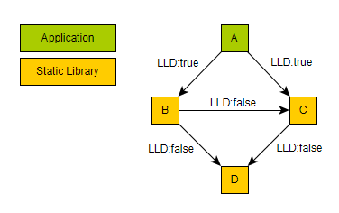

********
GDB 调试
********

Introduction
============

gdb 操作，相当于直接操作CPU与内存。 CPU的状态是可以通过寄存器的状态来进行控制的。例如set next step, 相当于修改 PC,IP 寄存器值。 

debug都是基于debugsymbol中，这个symbol会存储debug与source code line num 的对应关系。
断点不能hit,也就是没有dbgsymbol没有，或者你的源码位置与dymbols中是不一致的。

如果首先看没有debugsymbol, :command:`sharelibs`. 然后 :command:`info lines`. 就知道了。
如果不匹配，会发生在build的机器与调试机器的环境的不同。 或者当时生成不是相对路径，或者现在相对路径不对。

可以修改相对路径，或者直接替换路径,例如下面

.. code-block:: cpp

   apt-get source linux-image-2.6.32-25-generic
   apt-get install linux-image-2.6.32-25-generic-dbgsym
   gdb /usr/lib/debug/root/vmlinux-2.6.32-25-generic
   (gdb) list schedule
   (gdb) set substitute-path /build/buildd/linux-2.6.32 /home/xxx/src/linux-26.3.32

同时可以用 objdump -Wl <lib> 来查看其path是否正确，特别//,\\ 这些分界符还有的那就是相对路径。
      

debug 的难点
============

#. 如何在别人不能断的地方进行断点设置。列如线程调试、远程调试，对正在运行的程序进行调试、gdb是可以的。
#. 如何理解对象的逻辑结构，进行快速地诊断。
#. 能够查看当前正在运行的调用stack，通过这些可以跟踪程序的内部运行机制。只要知道了原理，然后直接debug就可以得到更加真实可靠的知识，更快的方法是猜想+验证。 找几个具有特征点来看一下其调用关系。例如正常运行，以及特殊情况下，调用关系。同时在不同的时间调用关系，就可以得到系统运行的立体信息。
#. 同时debug工具能够提供汇编代码与源码之间的动态关系，并且通过查看这些可以得到一些感性的知识，例如一条正常的语句的汇编语句呢。 要把语言常用结构都给过一下。
#. 一般作为人机接口的协议栈都会提供两种接口，humnable接口，还有一种那就是MI接口(machine interface)，例如telnet，tl1，机器接口不会回显。 perl 语言能远程调试吗。(什么？)
#. 调试分为与硬件相关的与内核相关的，与硬件相关的，例如中断信号机制，对于内存地址的转变，以及系统资源状态的变化。例外那就是进程的状态，线程的状态，以及调用堆栈的变化，同时系统调用库的变化，以及编程语言的转化，例如脚本语言到高级语言，再从高级语言到汇编的转化过程，在调试的过程要学习编译原理。
#. 变量声明的语句是没有，编译之后就没有了，所以不能在变量声明的地方设置断点。但是解释型好像就可以，例如在perl里是可以的，试一下java是否可以，以及其他语言。
#. 多线程如何调试。

#. gdb finish 执行完这个函数余下的部分，
#. gdb until 执行到当前函数的某一位置。

vS 已经实现了更新debug方式，那就是在每一个断点处生成snapshot,这样就可以来全回退，这样就不需要每一次重新运行了。对于 gdb来说，我们可以完成每一次的手工的生成与加载切换不同coredump. 同时gdb 还自身也有bookmark的功能。

   .. code-block:: bash
      
      bookmark start/end
      goto-bookmark
      help bookmark 这个功能是在 gdb 5.6之后就有了。

.. code-block:: bash

   #load core-file
   gdb> core-file <coredump>
   #gen
   gdb>generate-core-file [file]
   gdb>gcore [file]
   gdb>set use-coredump-filter on/off
   you can check /proc/pid/coredump_filter

批量的添加断点
--------------

在gdb 中直接用info source 或者info functions 就看到全部函数名，并且还可以用python来操作，就像vim中一样。要把gdb练成vim 一样熟悉。
这样就可以直接用trace命令来收集数据。
VS中对于immediate Windows是可以执行一些调试命令，并且提供运行时库的相互环境，就像一个脚本语言解释环境一样。
另一种方法，那就是利用event来收集数据。还有那就是系统的signal.
https://xpapad.wordpress.com/2009/05/18/debugging-and-profiling-your-cc-programs-using-free-software/ 关键就是检查了symbol table了。

gdb,attach 意味着你进入这个进程的空间，可以方便它的一切。

调试器的用途
============

#. 可以动态查看程序的各种信息，ABI，以及有哪些库的依赖。所以遇到查询各种信息的可以直接debugger联接上去。
#. 动态修改代码，及执行其内部的函数。
#. 动态获取系统的状态。
#. 如何定时debug.  可以通过添加asm(bkpt) 来实现。

如何实现引导代码
================

profiling都是支持tree 的，调试也是一样的。自己可以设置一个引导程序然后来加载自己的应用程序。然后把调试移至后面。这里用到那就是 *gdb set follow-fork-mode* 与 *detach-on-fork* 等。`gdb process tree <http://www.360doc.com/content/12/0311/11/7775902_193444555.shtml>`_ .
另外那就是 *gdb wrapper* see `here <http://www.ibm.com/developerworks/cn/linux/l-cn-gdbmp/index.html>`_ .

#. `gdb wraper <https://sourceware.org/gdb/current/onlinedocs/gdb/Starting.html>`_ . 

Debug 的实现机理
================

实现三部分，

用户的输入
----------

user interface,除了CLI接口可用各种后端，例如ddd,以及VS的MIEngine. 可以利用 readline/history等库。

gdb 可以当做后台，也可以直接使用，同时也支持vim 类似的分屏功能，利用layout的函数就可以实现。
符号处理，symbol handling, 这里主要是由 BFD/opcodes来处理。

要解决的在什么加载符号表，以及如何手工加载，一般情况下，在文件被调用的同时加载符号表，如果没有加载,可以load,unload重新做。 add-symbol-file/from memory
同时在 命令行也是可以指的，  --symbols, --write 可以应用程序写入信息。
目标系统控制层:  用ptrace类似的系统调用来实现。

断点原理 
--------

通过查找输入的断点和具体代码位置对应起来，并在该位置替换为一条断点指令，并且保存以前的指令，到目标程序运行到该断点处时，产生SIGTRAP信号，该信号被GDB捕获，GDB查找断点列表来确定是否命中断点。继续执行的时候则会把保存的指令重新放回并执行。n/s/ni/si/finish/uitil也会自动设置断点。
条件断点的实现，也就是对于SIGTRAP的event callback chain上的一个而己。

断点插入的时机，gdb 将断点实际插入目标程序的时机：当用户通过 break 命令设置一个断点时，这个断点并不会立即生效，因为 gdb 此时只是在内部的断
点链表中为这个断点新创建了一个节点而已。 gdb 会在用户下次发出继续目标程序运行的命令时，将所有断点插入目标程序，新设置的断点到这个时候才会实际存在于目标程序中。与此相呼应，当目标程序停止时， gdb 会将所有断点暂时从目标程序中清除。

http://www.kgdb.info/wp-content/uploads/2011/04/GdbPrincipleChinese.pdf

信号
----

内核传递给被调试进程所有的信号，都会先传递给GDB再由gdb采取定义的动作来和被调试进程之间进行相互协调操作。gdb暂停目标程序运行的方法是向其发送SIGSTOP信号，GDB对于随机信号（非GDB产生的）的处理包括，可以通过handle signals命令来预定义
 
对于信号的处理，gdb如何反应，另一个那就是要不要传给debugee本身。

`GDB的实现 原理 <http://www.kgdb.info/gdb/gdb_principle_ppt/>`_  以及如何手工操作 /proc*

目标的系统的控制
----------------

而在对子进程数据访问过程中，ptrace函数中对用户空间的访问通过辅助函数write_long()和read_long()函数完成的。访问进程空间的内存是通过调用Linux的分页管理机制完成的。从要访问进程的task结构中读出对进程内存的描述mm结构，并依次按页目录、中间页目录、页表的顺序查找到物理页，并进行读写操作。函数put_long()和get_long()完成的是对一个页内数据的读写操作。

除了修改数据，同时CPU的结构也是可以改的，各种寄存器值，以及堆栈的值，如何确定特定的位置呢。

一种是通过寄存器，因为各个寄存器在ABI上有对应的分配,例如一般R3放返回值，PC程序寄存器值，SP,BP,是段值。 直接用汇编就可以任意的指定。

虽然用汇编是灵活了，但是细节太多，太麻烦呢。如何在C语言达到汇编的效果呢。问题的关键是一些高级语言与低级语言没有直接mapping关系.其实也不是没有关系，而是以前不知道分配策略而己。一是可以用ASM接口而做，二是直接特殊变量的位置，来得到邻居的位置。
例如 不同类型的变量，static,global变量，还有函数中第一个变量，它的地址进行加加减减就可以得到其他变量的值，例如最后一个变量地址+1就是return或者call之前的 寄存器的值，这时候只需要用指针来修改一下内存就行了。同时也可以用函数指针，就可以得到代码段的数据本身。

研究编程这么久，从开始就把这一点给忽略了，从学习微机原理时候就知道CPU有单步执行的模式。其实也是通过中断的来实现的。在汇编语言中可以直接加入bkpt，或者trap 指令来实现。这也就是breakpoint与tracepoint的源头了。执行这个指令CPU就会停下，你可以查看CPU的各种信息。也就是所谓的调试。这个其实与python  pdb.settrace()的功能是一样的（今天才知道它是如何实现的）。其实就是bkpt 的功能。如果自己在代码的任何地方停，就可以在里面直接加入asm("bkpt;")就会断下来，这个然后再进程发一个 SIGCON来走下去。现在知道如何利用汇编直接操作硬件了。这也就是今天看CUDE asmdebug的代码的成果吧。如果这一下能停，可以查看或者硬件各种寄存器了。就是现在linux也只是利用CPU的部分功能。例如linux只用CPU的执行等级中二级。如果充分利用硬件功能，那就要是汇编了。

同时硬件也提供硬件hardware，也有采用软中断的方式。 
硬件本身可以提供一个断点表，同进也是软断点，实现。对于汇编来说直接就是bkpt这些指令了。对于高层代码是如何实现的，那就是debugInfo的表，这里有每一行有效代码对应的汇编地址。这里会提供每个函数的入口与出口地址，也就是LOW_PC 与HOW_PC，有了这个表，可以生成callgraphic，  一旦有这个表，就像往你的代码里注入任意的代码，所谓的那些profile参数就是这么看的，每一个函数执行的开始与结束都加进代码。或者直接全用tracepoint 来实现。 通过分析，每一个函数指令位置，然后查看中间的jump指令，就看ABI是如何规定函数调用。就可以画出这个图了。这样通过objdump 得到debug infotable,然后根据这个表生成call graph. 并且已经有这样工具利用h -finstrument-functions,在编译的时候加上这些选项。

   * `556-creating-dynamic-function-call-graphs <http://nion.modprobe.de/blog/archives/556-creating-dynamic-function-call-graphs.html>`_ 
   * `egypt <http://www.gson.org/egypt/egypt.html>`_ 
   * module List的作用 可以用查看真实应用程序使用哪些库，并且库的版本信息等等。直接attach到可执行程序就可以得到这些信息了。例如battle的vcrt 就是这样查到的。当然在linux下会有ldd.
   * debugger是如何知道各种映射关系呢* 就是app中debug info.
     `/how-debuggers-work-part-3-debugging-information <http://eli.thegreenplace.net/2011/02/07/how-debuggers-work-part-3-debugging-information/>`_ 
   * `调试信息 <http://blog.jobbole.com/24916/>`_ 
  

如何在任意地方设置断点，如何找到函数的指始点，只要是可以执行文件，必然会有一个entry address,得到这个地址，看看其对应的代码的哪一个函数也就自然找到入口点了。

现在知道如何编译来进行分析source code了。

另外一点，那就是调试的那些信息都从哪里来的呢。

同时可以在 通过 `info share` 来查看指令段，就可以知道在哪里哪一个库crush,并且还可以知道在哪里设置断点。并且利用addr2line 就可以得到。

当然也可以直接在 gdb 中实现这些事情。例如 info address symbol等等。

.. code-block:: bash
   
    info address symbol
    info symbols addr
    whatis expr 
    whatis

这些可以非常方便让我来查看 ELF的生成格式，这个要比 objdump要直接有效的多。

in linux, you can use signal and /proc and some CPU interrupt do debug, don't need the GDB.  for example on the production line. You can do like this.  send Pause signal to the process and check the /proc directory to get the status of the process.
`Proc interrupts <http://www.crashcourse.ca/wiki/index.php/Proc_interrupts>`_ , 
`/proc/interrupts 和 /proc/stat 查看中断的情况 <http://blog.csdn.net/richardysteven/article/details/6064717>`_ 
那到底是用的硬中断来软中断来实现的呢。并且gdb 还支持对gdt,ldt,idt的查看DJGPP 。

.. code-block:: bash

   info dos gdt/ldt/idt/pde/pte     ;info w32 info dll 

几种方式是插入汇编asm(bkpt) 代码，或者采用指令替换的方式，例如在原理断点处插入跳转指令。把原来指令给换掉。 BP的插入也是代码注入的一种。
汇编的bkpt指令是一个字节，然后把第一个字节换掉，然后把原始指令保存下来。有两种做法,single-stepping inline,Single-step out of line.

gdb 主要是基于ptrace来实现，ptrace系统调用可以修改，进程的数据段与代码段的数据的，同时修改CPU的指令模模式。 进程是即有CPU的模型信息，又有代码与数据的信息。通用ptrace可以控制进程各种信息，例如加载什么包，调用过什么函数都可以用这个来进行控制调用。 http://www.spongeliu.com/240.html
可以参考这本书GDB Pocket Reference。
http://www.cnblogs.com/catch/p/3476280.html， 使用ptrace可以实现进程各种定制操作。
http://www.linuxjournal.com/article/6100?page=0,1

ptrace是通过发送SIGSTOP让进程挂起的,ptrace也是通过系统信号来与进程交互的。ptrace是通过修改断点处的指令为trap指令来实现的。ptrace采用SIGCHLD的编程模型，即目标进程发送SIGCHLD，调试器调用waitpid来等进程。

但是ptrace也有很多的缺点，例如一个进程只能被ptrace attach一次。将来会用utrace来取代。
http://www.ibm.com/developerworks/cn/linux/l-cn-utrace/index.html

当然主要是也sigtrap信号的实现，不管CPU的硬件实现，还是软件实现。原理都是一样的，因为在于速度: http://stackoverflow.com/questions/3475262/what-causes-a-sigtrap-in-a-debug-session

并且虚拟机也是通过ptrace,来实现的，现在可以用utrace来实现。

变量的值
--------

我们在调试器里看到的变量的值，都是从哪里来的呢。是在内存里，还是在寄存里。对于CPU这种时分复用的机器，变量基本上就都存在内存里，而寄存上只是短暂的时间片的瞬间，
所以说这些值是内存的哪一段放着，并且它的邻居是谁呢，这样同样会大大影响存取的性能的。如何得到这个变量的赋值表呢，就是简单的bss段以及.data段吗。

一种是全局变量，文件静态变量，函数的静态变量如何查看,通过

.. code-block:: cpp

   file::variable
   function::variable

同时 gdb创建了 variable object 这个是为 frontend与gdbserver之间同步信息使用。哪些内容我关系，我发一个variable object过去。有更新变化就得通知我的方式。
http://ftp.gnu.org/old-gnu/Manuals/gdb/html_node/gdb_231.html
https://sourceware.org/gdb/onlinedocs/gdb/GDB_002fMI-Variable-Objects.html

经常看到些结构是欠套的，所以经常看到 -var-create next的东东。

为了减少数据的传输，也做了各种优化。例如 :command:`trust-readonly-sections`. 只读数据不就需要从传输了，从本地取就可以了。

这是同步一种方式，相当于双方建立同样的符号表状态表，server那些有变化就通知client,没有的话就只用保持同步的heartbeat了。 当然client自身还是可以做别的事情。
那就是通过event来同步，可以是同步，也可是异步的。例如step in/out/over应该是同步。 其他的就可以是异步的。

进程表与线程表
--------------

这个又是读的信息呢，正常怀况是进程是读的全局的GOT，是直接读的还是通过API呢。

而线程表则是每一个进程内部的TLS吧表吧。

module列表
----------

elf结构的哪一些块放着呢。
module 加载的顺序采用深度优先的模式，并且得不断改写进程中GOT表，来进行重定位那些lib。这些module都是按照顺序加载的。逐section加载的。然后需要不断的调整各个.got表，以及.got.plt。 各个module就是通过自己.got 与.got.plt形成一个module链。
这个列表是可以用 :command:`info file` 来看到的。
对于动态的链接库来说，第一个加载就应该是 /system/bin/app_linker. 
在哪里寻找这些库，可以用set-solibsearchpath 来设置，原理path的一样的，不支持递归。 或者直接用 sysroot来进行统一的设置。
同时加载 moudle还可以定制化，

.. code-block:: sh

   set stop-on-solib-events 0/1
   show stop-on-solib-events
   auto-solib-load

来设置加载lib是否加载， lib.  当然也可以用sharelibrary来强制加载一个或者全部的symbol单独来做。

http://visualgdb.com/gdbreference/commands/set_auto-solib-add
http://visualgdb.com/gdbreference/commands/set_stop-on-solib-events

GDB 会在solibpaths 中按照顺序查找匹配的lib. 匹配的标准:

#. 名字相同
#. 有DWARF section
#. Arch match
#. build-id RSA 签名验证一致
 
同一个库，加载找到第一个，如果每一个失败，停止继续寻找这个库。

VS 给的link 顺序为 A,D,C,B;而gcc 需要顺序为 A,B,C,D.

代码块
------

既然代码可是每一个代码一个section,那在内存里呢，这个表又是如何组织的呢。在内存里是把所有代码放在一起呢，还是每一份独立放置的。这些都是可以通过调试器可以得到的。

写两个函数直接放在一起，然后最后两个内存地址相距多远。

callstack是如何查询的
---------------------

这个当然是通过进程的栈来查看的，如果在不出栈的情况下就知道下函数调用在哪里，是如知道一个函数占用了多少呢。

disassmbly window
-----------------

这个window是把代码段给解析了出来。

Auto local Watch 
----------------

三者分别在哪里，

#. auto 应该是当前指令正在执行的变量，应该这个时候就都已经在寄存里的。
#. local 变量应该是函数内部变量，就是当前栈里所能看到变量。前auto一样是动态的。
#. watch 而是 .bss 以及 .data对应的内存段。

通过这些地址就可以知道，进程大概的内存分布状况了，并且只要找到起始值，就知道其范围了。

而那些debug info 这些默认起动不加载呢，还是根据文件本身，有了就加载，没有就不加。

而这些是通过 GDB variable object 来实现的。

符号表以及其加载机制
====================

debug_info 表对于调试起着至关重要的意义，它是源码与二制码之间的桥梁，只有debug_info 表认出来了，才能知道走到了源码的哪一行了，没有符号表那只能调试汇编了。另外没有符号表，BP就认不出来，因为你的断点是加在源码上。所以不能hit断点，两个东西要去查，符号表是否加载了，一个是相关库是否加载，另外库是带有符号表，还是被stripped, 库加载了，但是符号表没有加载。如何判断呢，在加载之前设置断点，然后一步步来，看看能不加载。例如module列表，是不是加载。另外还要看符号表有没有。

一般情况下debug_info表生成是绝对路径，当然也可以设置生成相对路径。当采用remote debug时，采用相对路径就会相对方便一些。 

debug_info表与 符号表是不同的两表，符号是要程序动态加载的用的。具体见符号表。

对于gdb中要设置的一个是 solib-search-path. 另一个就是源码目录，directory

同时当大的obj文件中，加载symbol本身也会很慢，gdb 支持 生成index来加速这个过程，同时一些编译也支持生成。
另一方面在remotedebug时，把远程的sysroot给提前cache到本地就也可以加块速度。 例如 android的备份的是

同时也可以 ``set sysroot    target://``

.. code-block:: bash
    
   system/bin
   system/lib
   system/vendor/lib

.. code-block:: bash
   
   gdb -batch -nx -ex "save gdb-index C:\\directory_path" "C:\path_to_UE4_project_output_directory\libUE4.so"
   

自动加载原理
------------

符号表放在obj文件中一个独立的section.符号的加载随着.so的加载而加载。所以.so加载顺序就决定了符号表的加载顺序。而 *.so* 的加载顺序是按照链接的顺序，并根据依赖树，采取深度优先的机制来加载的。 并且如果前面已经加载了，后面就不会再加载了。 而module 列表会显示加载顺序。这个顺序与 *solib-search-path* 一般情况是不一样的。 这是由于加载是根据依赖树深度优先来的。

手动加载symbol
--------------

#. info symbol 
#. 查看加载加了.so

   :command:`info share`

#. 构造路径

   :command:`set sysroot`
 
#. 加载symbol

   :command:`symbol-file filename`

 
一旦符号表加载了可以查看符号表的内容

.. csv-table:: symbol command
   :header: Name,Content

   info line , 查看符号与源码行的对应关系
   info source/sources, 查看源代码的信息
   info symbols, 查看符号表
   info function,查看加所有函数

.. note::

   这些都通过查看online help来得到更多的信息

例如遇到了中途遇到crash,但是此时没有debug 信息怎么办，这里可以要求重新加载一下 lib,重新进行一次解析就可以。 这时候就需要用到

:command:`symbol-reloading  symbol-reload`   当然自动加载的时候，也要注意库的名字，名字不一样的时候，也是找不到的。
这样时候ln 就可以来帮忙了。当然也可以直接改名换路径。当然如加载的lib不对时，会报linkzip error.

GNU GDB
-------

debuger 是一个大工程，不仅检测CPU的状态，还要提供一个运行时环境，就像tclsh一样，可以实时运行情境。

.. graphviz::

   digraph gdb {
       rankdir=LR;
       gdb -> {BP; CPU;Program;OS;target;server;Interface;ownSettings;stack;SourceCodeView;DataView}; 
      
      // break point 
       BP -> {breakpoints;watchpoints;catchpoints;tracepoints};
        breakpoints [shape=record, label = "break | break function | break +/- offset | break linenum | break filename:linenum | break filename:function | break \*address |break if | tbreak|hbreak |thbreak | rbreak regex "];
        watchpoints [shape =record, label ="watch | watch expr | rwatch expr | awatch expr | info watchpoints "];
        tracepoints [shape=record, label = "{trace|tfind,tstart,tstop,tstatus,tdump,save-tracepoints|passcount | actions |collect data | while-stepping }"]
       Interface-> {HI;MI};
       // 
       Program -> {Inputs;Outputs;Execution};
      Inputs [shape=record,label ="<f0> Inputs |<f1> args |<f2> corefile| <f3> attach "];
      Outputs [shape=record, label ="<f0>Outputs |<f1>  STDOUT |<f2> STDERR" ];
      Execution -> {Step,Continue;Next;Until;Jump;Thread};
      Thread [shape=record; label = "thread |   thread threadno | info threads | thread apply "];
   
      //stack
       stack->stackOps;
       stackOps [shape=record, label = "frame args |select-frame"];
      //SourceCodeView
      SourceCodeView -> viewOpts;
      viewOpts [shape=record,  
                label="{list|set listsize |linenumer |function |*address} | \
   	            {search regexp | forward-search|reverse-search} | \
   		    {dir |directory show directories }| \
   		    {file | symbol file | core-file, exec-file |add-symbol-file |add-shared-symbol-file | section } | \
   		    {mapping linetoaddress |info line *address|disassemble  range | set disassemble-flavor }"
   	     ];
      //DataView;
      DataView  [shape=record,
    		label= "{DataView  || \
                            p/xuf \*array@len  \l \
                            x (type) \*array@len \l}"
        ]
       
   }

breakpoint
----------

,不仅能够disable/enable以及one stop,还能设置回调函数，不仅可以使用gdb脚本还可以被调试对象函数，以及第三张通过环境变量shell=指定的脚本。是支持python的。

watchpoint
----------

 用完就会背删除，并且不能直接加断点，必须每一次用完之后要，要重新设置，pentak是否会保存，并且如果是软件实现的话，速度会非常的慢，并且在多线程里，如果是软件实现只对当前的线程有效。

catchpoint
----------

gdb 提供对load,try,catch,throw等等支持，另一个更加直接方式那就是对用__raise_exception.加一个断点，类似于perl中把把DIE包装一下。

对于程序的执行控制，利用exception, singal 等等控制。 

例如对不起trhow, catch,exec fork,load等等控制，都可以直接用catch 命令设置，而对于程序自身那就是raise() 来发启signal,可以用raise(),signal()结合起来实现一个状态机。http://www.csl.mtu.edu/cs4411.ck/www/NOTES/signal/raise.html

tracepoint
---------- 

this is just a pm point of SDH. you monitor the system state at the tracepoint, you can collect the data. so you that %RED%how to use tracepoint to make write down execution log just bash set +x%ENDCOLOR% the core-file is implemented use this.I guess so. there are three target for GDB: process, corefile,and executable file. what is more, GDB could offer some simulator for most of the GDB.  

.. csv-table:: 

   target , sim, exec,core,remote ,
   os , set, info ,

next,step,until,contil，return,jump,fg,ignore 
---------------------------------------------

这些命令都有两种xxxi这种，是针对机器指令，也就是汇编指定的，另一种是针对源码的。并且后面都可以跟一个数值来实现循环。 进入了gdb后，你完全可以重起组织代码执行顺序，甚至把应用当做一个库，利用gdb脚本重新实现一遍应用程序，例如直接把attach上当前的进程，然后，加载自己的东西，因为gdb是支持写回功能的。这样就可以强hacking 的目的。

---

display  automation display the info
*display /i $pc*
---print and x
you can also control the scope and format of data. by <verbatim>set print XXX //static-memebers ,vtbl </verbatim> and meanwhile you can retrive the history value of the variable. by *.$. $ is special symbol. $$n refers to the nth value from the end.

In GDB there is convenience variable(prefix with $ $AAA,$BB) you use it during the whole GDB life.
*register* you can also get the register value from =info registers=  or = print/x  $<registername>= 

the strongest point is that GDB could manipulate the memory directly. <verbatim>mem address1 address2 attributes ...</verbatim>
there is also a cache for data.

BP set 
------

when I can I set the BP. 在今天的测试中，断点能设置在哪，并且是否被击中，并且什么被解析了。例如在空白处是不能设的，编译形与解释型debug有区别吗，

working language and native language.
-------------------------------------

you do extension for gdb as native lanuage or working language. you control these by show/set language. info extensions.  different language supported different type and range check.

GDB extension
-------------

gdb 支持自身命令的扩展，一种是通过<verbatim>define commandname</verbatim>. 另一种通过命令hook来实现。另外现在gdb 都支持 `python来进行扩展 <http://sourceware.org/gdb/onlinedocs/gdb/Python.html>`_ 。并且gdb也是可以`http://docs.python.org/devguide/gdb.html <直接调试python>`_ .

.. cas-table:: 

   meta element , define commandname , define a new function ,
            ^ ,  if,while document,echo,printf,output ,
            ^ , help user-defined,show user ,
   hook , hookpost-XXX , after ,
     ^  , hook-XXX ,  before ,
   command file   ,  source, .gdbinit <verbatim>gdb <cmds >log 2>&1</verbatim> ,查一下pentak这个是在什么时候调用的 ,

now, there is good example for define command,  ndk/common/gdb/common.setup for art on.

pretty printer
--------------

GDB 是支持python,并且可以通过python来实现大量的定制化，例如正好的显示，当然也可以利用python 起动一个socket 然后当做一个server,来远程操作一些东东。当然今天先看python 对于显示的优化。
`c-gdb-python-pretty-printing-tutorial <http://stackoverflow.com/questions/12574253/c-gdb-python-pretty-printing-tutorial>`_   
gdb 如何直接执行python

.. code-block:: python

   python
   import sys
   print afa
   end

通过学习 ndk 中ndk-gdb-python 来作为参考。  gdb 扩展可以参考`Extending GDB using Python <https://sourceware.org/gdb/onlinedocs/gdb/Python.html#Python>`_   `visual-studio-debugger-related-attributes-cheat-sheet <http://khason.net/dev/visual-studio-debugger-related-attributes-cheat-sheet/>`_  这里讲了一些 debug的设置。

gdb 中使用 python 类似于 vim 中使用 python 一样的。

对于一些负责的数据内存数据结构，完成可且numpy + Image 等等方式来进行可视化。这个是最简单有效方式，加载一个解释器，能够访问进程的内存空间
然后对其可以做任何操作。

也可以利用gdb + python来做各种单元测试。

对于PentaK 与VSAuto 都会 visualize功能。基本用法那就是根据结构体类型如何显示其内容，例如只显示头，以及如何以树形展开，因为对于基本的基本的数据结构的组合。
`浅谈autoexp.dat文件的配置 <http://blog.csdn.net/lingyin55/article/details/6600447>`_  以及我们http://devtools.nvidia.com/fogbugz/default.asp?30959 

`VS2013 Visualizers <https://msdn.microsoft.com/en-us/library/ms164761.aspx>`_ 

`How to write Visualizer <https://msdn.microsoft.com/en-us/library/ms164759.aspx>`_  分两部分 debugger,与debugee两部分。然后根据模板来显示。

VS 自身的模板在 :file:`C:\Program Files (x86)\Microsoft Visual Studio <version>\Common7\Packages\Debugger\autoexp.dat` 里。

基本类型，整型，长整型，十六进制，以及浮点树，以及字符串。
这里分preview and stringView,children, 基本的数据结构有#array,#list,#tree, # 本身，以及特殊的自由变量。

$e,$c 是自由变量，m_pszData等等结构体自身变量。

这个类似于python中pytable的功能，可以直接table值。

``type=[text]<member[,format]>....``

http://www.xuebuyuan.com/1300115.html 这是一个不错的教程 
http://blogs.msdn.com/b/joshpoley/archive/2008/01/24/custom-debugger-auto-expansion-tips.aspx
http://www.manicai.net/comp/debugging/visualizer/

GUI 
---

gdb 两种方式支持GUI就像VS那样，一种是自带的TUI接口，另一种那就是利用Emacs做为界面。

while 循环的汇编实现
--------------------

汇编的时候是直接跳到第一内部第一行执行的。dissembly window 提供行号，源代码等等东西，可以很方便的找出其翻译的对应关系。  调试信息表都有哪些信息，为什么没有源码，调试就跟不进去，能否调试Java虚拟机的原语操作呢。

反编译
------

反向工程向来是个大课题，把C语言翻译成汇编，并反过来，就一定成立，因为语言之间不是一一切对应的关系。所以可读性会非常差。但是也是可以参考的。` 反汇编 <http://baike.baidu.com/view/637356.htm>`_    `IDA pro 5.2 反汇编代码转C语言插件 <http://download.csdn.net/detail/masefee/1255219>`_ 

core dump 调试
==============

#. 开启core 文件的生成 :command:`ulimit -c unlimited`
#. gdb 分析core文件 :command:`gdb debugme core.xyz`
#. 动态生成core,   :command:`gcore pid`.
#. 动态生成strace  :command:`strace -p pid` .
#. 调试正在运行的程序 :command:`gdb debuggee pid`.
http://linux.maruhn.com/sec/glibc-debug.html

.. code-block:: bash
   yum --enablerepo='*debug*' install /usr/lib/debug/.build-id/c7/8fbda71040fadd2879a75cf9f3ee259853dc36.debug
   # ubuntu   /usr/lib/debug/{lib,usr} https://wiki.ubuntu.com/Debug%20Symbol%20Packages
   # add ddpkg , apt-install xxx-dbg or xxx-dbgsym
   $gdb --core=core.990014
   (gdb) info proc mappings
   (gdb) add-symbol-files xxxx
   (gdb) bt
   

利用信用号来进行调试
====================

http://www.ibm.com/developerworks/cn/linux/l-sigdebug.html. 在代码里自己给发一个停下来的信号就行了，然后gdb在attach 上来就行了。

.. seealso::

   * `jdb IBM web <http://www.ibm.com/developerworks/cn/java/joy-jdb/index.html>`_  %IF{" '' = '' " then="" else="- "}%
   * `VS 调试技巧 <http://blog.csdn.net/wojiushi3344/article/details/7960275>`_  VS 的immediately Window 就像tcl那个调试器的功能，也就是给你一个运行时环境，就像脚本语言的解释器一样。可以直接调用你的所有函数。`MSDN 参考命令 <http://msdn.microsoft.com/en-us/library/ms171362%28v=vs.100%29.aspx>`_ 
  * `vs2010调试技巧 <http://wenku.baidu.com/view/fbce91f9f705cc1755270920.html>`_  %IF{" '' = '' " then="" else="- "}%
   * `符号表 <http://zh.wikipedia.org/wiki/&#37;E7&#37;AC&#37;A6&#37;E5&#37;8F&#37;B7&#37;E8&#37;A1&#37;A8>`_  %IF{" '二进制可执行文件结构' = '' " then="" else="- "}%二进制可执行文件结构
   * `MSdebug  <http://msdn.microsoft.com/en-us/library/ff541398(v&#61;VS.85).aspx>`_  %IF{" 'NV debug wiki' = '' " then="" else="- "}%NV debug wiki
   * `core file for debug <http://bowen.blog.51cto.com/136148/96867>`_  %IF{" '' = '' " then="" else="- "}%
   * `sparc-stub.c <http://opensource.apple.com/source/gdb/gdb-954/src/gdb/sparc-stub.c>`_  %IF{" '' = '' " then="" else="- "}%
   * `Extending gdb <http://sourceware.org/gdb/onlinedocs/gdb/Extending-GDB.html#Extending-GDB>`_  %IF{" 'you can use python ,gdb cmd, alias to shell programming.' = '' " then="" else="- "}%you can use python ,gdb cmd, alias to shell programming.
   * `Visualgdb <http://visualgdb.com/KB/?ProblemID&#61;nopkg>`_  %IF{" '' = '' " then="" else="- "}%
   * `GDB学习总结--实现原理 <http://bbs.chinaunix.net/thread-1946512-1-1.html>`_  , `Linux信号列表 <http://hi.baidu.com/xzwnspnimnisuze/item/6cb2c41a1bd411ea9913d659>`_  gdb 是利用SIGTRAP信号来实现的。至于SIGTRAP是用硬件还是软件这个要看内核了。
   * `gdb server manual <http://ftp.gnu.org/old-gnu/Manuals/gdb-5.1.1/html&#95;node/gdb&#95;130.html>`_  %IF{" 'gdb server 也是可以直接加载应用程序，而不是只能attach,只是pentaK 对于APK采用这种方式' = '' " then="" else="- "}%gdb server 也是可以直接加载应用程序，而不是只能attach,只是pentaK 对于APK采用这种方式
   * `gdb 如何调试多进程 <http://www.ibm.com/developerworks/cn/linux/l-cn-gdbmp/>`_  %IF{" '一个方法，gdb wrapper. 一旦设置的断点，就会引用SIGTRAP信号。' = '' " then="" else="- "}%一个方法，gdb wrapper. 一旦设置的断点，就会引用SIGTRAP信号。
   * `Miscellaneous GDB/MI Commands <https://sourceware.org/gdb/onlinedocs/gdb/GDB&#95;002fMI-Miscellaneous-Commands.html>`_  %IF{" '' = '' " then="" else="- "}%

Thinking
--------

*远程调试*
远端与近端要配套才行，有两种情况，一种是远端可以执行文件本身含有调试信息的，第二种那就是远端没有调试信息，而是需要本地提供的，加载各种调试信息以及原码，只是依赖远端的进程与本地拥有相同地址，通过地址对应来实现调试。当然你可以自己实现一个gdbserver,并且gdb已经预留了接口与模板，remote.c 并且在attach的过程，gdbserver 会先向进程发一个暂停信号，然后连接上去。这些是根据进程与内核的之间的调度来实现的。`A minimal GDB stub for embedded remote debugging. <http://www.cs.columbia.edu/~sedwards/classes/2002/w4995-02/tan-final.pdf>`_  ,`GDBstub的剖析与改进 <http://www.mcu123.com/news/Article/ARMsource/ARM/200705/4297.html>`_ ,并且gdb源码为库中还提供了大量的模板与例子。对于常见一些CPU架构的支持。
例如android 的调试 use Project Symbol 参数一样。你要选择：

.. code-block:: bash

   "/system/bin/app_process", "/system/lib/", "/system/bin/linker            C:\Users\vili\AppData\Local\Temp\Android  并且按照设备号来存放的。
   为什么要linker   这个linker是做什么用，如果不需要本地的话，就只需要app_process与linker.
   
   gdbserver + unix_debug_socket --attach 123
   
`Debugging an already-running process <http://www.ofb.net/gnu/gdb/gdb_22.html>`_  --attach function need system support. there is an process concept. how about the bare board target.

其实也很简单， --tty是可以直接指tty的。
-- Main.GangweiLi - 05 Feb 2013

*数据一致性*
特别是在troubleshot的时候，尤其要注意这个问题，例如你改的文件，没有保存，保存了没有重新编译，编译了没有重新deploy，以及远程调试两边的版本不一致。都会感觉到莫名其妙。怎么看都对，就是结果不对。

-- Main.GangweiLi - 05 Feb 2013

*多线程调试*
step by step时，能不能跨线程或者手工进行线程切换 是根据CPU的架构以及 scheduler-locking 来决定的，在gdb中是可以设置的，*set scheduler-locking mode*。线程内部的调用关系，都要很方便的显示出来。多进程调试有同样的问题。可以查看每一个线程的状态，并且可以进入每一个进程。
`All-Stop-Mode <http://sourceware.org/gdb/onlinedocs/gdb/All_002dStop-Mode.html>`_ 

-- Main.GangweiLi - 07 Feb 2013

*quickly debug*  call stack and filter BP. One more is diff with the baseline. the first get workable path, and then look at the difference between each other.

-- Main.GangweiLi - 08 Mar 2013

*execution control*
you execute an command just like tclsh. should be able to jump at the source code for example skip some step.    The arguments to your program can be specified by the arguments of the run command, They are passed to a shell, which expands wildcard characters and performed redirection of I/O, and then to your program, Your shell environment variable specifies what shell GDB uses.

the environment of software :  working directory.  lib search path, stdio.

-- Main.GangweiLi - 14 Mar 2013

#. `automation gdb sessions <http://stackoverflow.com/questions/10748501/automating-gdb-sessions/>`_ 

.. code-block:: bash

   #!/bin/bash
   echo "run -c test.conf" > test.gdb
   echo "bt" >> test.gdb
   echo "bt full" >> test.gdb
   echo "info thread" >> test.gdb
   echo "thread apply all backtrace full" >> test.gdb
   until gdb ./core -x test.gdb --batch >test.log 2>test.err
   do date && echo "test server died with exit code $?. Restarting..."
   grep -B 10 -A 1800 "SIGSEGV" "test.log" > "testtrace.log"
   cat "testtrace.log" | ./paster | grep "http" >> "test.link"
   cat "test.err" > "testerror.log"
   sleep 31;
   done;

*shell interpretor*
You can regard the gdb as shell interpretor, the software you prime command you can use you shell language. the gdb shell include two: target language that you the language you debug. the scripts language, gdb support by it self. you can use both. Once the program you load, you can use all of this function. and you source the other scripts.  
`GDB-Python-API <http://sourceware.org/gdb/onlinedocs/gdb/Python-API.html>`_ ,
`Extending-GDB <http://sourceware.org/gdb/onlinedocs/gdb/Extending-GDB.html#Extending-GDB>`_  
there is .gdbinit file. and during the execution, you can source the scripts file. all the gdb cmd you can use it. 
and the input and output is every regular, you use the annotationlevel and machine Interface to do the automation.

-- Main.GangweiLi - 24 Mar 2013

you can just load the nostripped binary code. it just load it, not run it. and -g also include sourcecode in the binary execution file? when debugging, do we need the sourcecode, normally, we didn't need the sourcecode. and meanwhile, it means that -g binary and .so lib has the sourcecode information. how can we get the sourcecode from debug version binary.

-- Main.GangweiLi - 02 Apr 2013

*How to hit boot code*
normally, it execute quickly pass the stage. how to make this, one way is that you add a dead loop for exmaple int i=1;while(i). so when you hit it. and then change it i=0, and continue the execution. for the debugger, you can change the value at local window.  自己包引导程序等待一个信号来起动eglretrace，这样就可以给我足够的时候来--attach上去，当然引导程序，如果通用shell来直接来做就会更加方便。perl应该就可以，但是android只有简单的sh,如果可以这样最好，还有一个办法，直接--attach到程序的加载器上，然后可以控制后面的加载函数。

-- Main.GangweiLi - 10 Apr 2013

*info locals* window how to implement it. is it using this command?

-- Main.GangweiLi - 15 Apr 2013

*如何例出所有函数*
如何查询代码，所有函数名呢。不只是当前的文件。these operation is regard about symbol table. you set -n read symbol all at the inital. then you can do query the symbol(function name, varible name, CPU struction, address, any label). by these command
| info address symbol | Describle where the data for symbol is stored |
| info symbol add | print the name of a symbol which is stored at the addresss addr|
| whatis expr | print the data type of expression expr |
| whatis |
| ptype typename | print a description od data type typename |
| ptype  expr |
| ptype |
| info types regexp |
| info scope addr |
| info source | Show the name of current source file |
| info functions \[regexp ] | print the names and data types of all functions |
| info variable \[regexp ] | print the names and data types of all vrables |

the other hand, GDB offer another way to manipulate the symbol file just like (operation on section). you load it into gdb and query and modify it and save it.

-- Main.GangweiLi - 16 Apr 2013

*GDB的命令行编辑习惯*
你可以用VI-style, emacs-style, csh-like. it use readline lib to implement it. and readline lib support vi-style and emacs-style  以及history 功能。并且这个history 支持正则查找替换。
<verbatim>
set editing on/off
show editing
set history filename/size/save
set debug arch/event/expression/overload/remote/target/varojb/screen/versbose/complaints/confirm

</verbatim>

-- Main.GangweiLi - 16 Apr 2013

*GDB machineInterface*
this one is just like tl1. there is two mode. human readable/raw. and the telnet has two mode too. at the early age, gdb annotation to change this mode and emacs use it. 

-- Main.GangweiLi - 17 Apr 2013

*JUST IN TIME DEBUGGER* 
http://msdn.microsoft.com/en-us/library/5hs4b7a6.aspx   如何使用，并且今天看了，VS调试壳，是否可以利用vim或者emacas也来招调试器。

-- Main.GangweiLi - 06 Jun 2013

gdb就可以实现debug，看见汇编之间的关系吗？

-- Main.GegeZhang - 25 Jun 2013

什么是声明变量

-- Main.GegeZhang - 25 Jun 2013

*`arm exidx unwinding <https://wiki.linaro.org/KenWerner/Sandbox/libunwind?action=AttachFile&do=get&target=libunwind-LDS.pdf>`_ *

-- Main.GangweiLi - 22 Jul 2013

-- Main.GangweiLi - 30 Jul 2013

*对于指针内容的显示*
在我们使用指针时，常用的变量的类型就没有办法显示其内容了，使用指针，你可以任意组装任意的东西。但是如何查看了，就时候用到了，gdb 查看内存的方式了，p/xuf 等等。例如在native_globe里，生成那些顶点数据时都是使用的指针。如何查看这些值呢。使用immediateWindows现在是支持不了，直接连到GDB上发送一些命令。

-- Main.GangweiLi - 29 Aug 2013

Debugging Infomation In Seperate Files
--------------------------------------

https://sourceware.org/gdb/onlinedocs/gdb/Separate-Debug-Files.html

可以通过同名文件 xxx.debug或者build-id 进行同步，如果使用前者还会有一个 CRC的校验和。

同样可以用

:command:`objcopy --only-keep-debug foo foo.debug; strip -g foo` 就可以得到 debug info table file.

Ptrace
======

gdb 主要原理就是动态修改的进程的所有状态与内容，还有寄存器的能力。例如修改返回寄存器的值，就可以改其反回值了。

.. code-block:: c
    
   #include <sys/ptrace.h>
   Long ptrace(enum_ptrace_request request,pid_t pid, void *addr, void *data)
   /**/

request 是具体的操作。 

整个过程就是追踪者先通过PTRACE_ATTACH与被追踪进程建立关系，或者说attach到被追踪进程。
然后，就可以通过各种PEEK和POKE操作来读/写进程的代码段，数据段，或各寄存器，每一次4个字节
通过data 域传递，由addr 指明地址，或可全用PTRACE_SINGLESTEP,PTRACE_KILL,PTRACE_SYSCALL各
PTRACE_CONT等操作来控制被追踪进程的运行，最后通过 PTRACE_DETACH与被追踪进程脱离关系。

但是当多线程的时候，有可能PTRACE_CONT有可能会失败。http://stackoverflow.com/questions/16360366/ptraceptrace-cont-cannot-resume-just-attached-processes

脚本扩展
========

简单可以用gdb的本的shell来做，while,for，if也都是支持的。复杂的可以用python来做。就像vim一样。 
https://sourceware.org/gdb/onlinedocs/gdb/Python-Commands.html#Python-Commands

如何用gdb来收集数据
===================

tracepoint一个一个加太麻烦，有什么更快的一点方法，那就用gdb来做，最灵活。
具体某几个点可以用直接用tracepoint来做。
大面积可以用event,以及signal来做。
http://stackoverflow.com/questions/2281739/automatically-adding-enter-exit-function-logs-to-a-project

对于gdb.event可以python来做https://sourceware.org/gdb/onlinedocs/gdb/Events-In-Python.html
gdb.events.inferior_call_pre/post 事件。

对于SIGNAL直接用`handle SIGUSER` 来实现https://sourceware.org/gdb/onlinedocs/gdb/Events-In-Python.html 

一些其他的事件，http://visualgdb.com/gdbreference/commands/set_stop-on-solib-events
http://stackoverflow.com/questions/7481091/in-gdb-how-do-i-execute-a-command-automatically-when-program-stops-like-displ

https://sourceware.org/gdb/current/onlinedocs/gdb/Hooks.html#Hooks

最终看代码实现 https://sourceware.org/gdb/current/onlinedocs/gdb/Hooks.html#Hooks

.. code-block:: cpp

   define hook-stop

如果只是看stack,有这样的工具https://github.com/yoshinorim/quickstack
http://poormansprofiler.org/
http://readwrite.com/2010/11/01/using-gdb-as-a-poor-mans-profi/
https://github.com/Muon/gdbprof

用gdb来进行测试
===============

起真实的进程是最好的环境。如果能起app然后在这个context里，利用gdb来直接执行。
http://stackoverflow.com/questions/16734783/in-gdb-i-can-call-some-class-functions-but-others-cannot-be-resolved-why

但是一些编译复杂的结构，gdb是没有办法直接编译的，这个时候就需要JIT来帮忙了。

另外把测试的函数单独放在一个dll中，然后 dlopen来加载。
http://stackoverflow.com/questions/2604715/add-functions-in-gdb-at-runtime

即使没有，也可以临时写一个，只要编译的时候加上一个 :command:`-fPIC` 就可以了。

先生成一个coredump,然后再coredump中来进行各种各样的测试。

在crash直接调用gdb.
http://stackoverflow.com/questions/22509088/is-it-possible-to-attach-gdb-to-a-crashed-process-a-k-a-just-in-time-debuggin

尽可能不要在头文件中下断点，这样可能造成n多断点，在n多地方。 是由于断点寻找机制造成。

shared object 在加载之前，是加不上断点的。 这也就是为什么我们hack lib-loaded event的原因。

